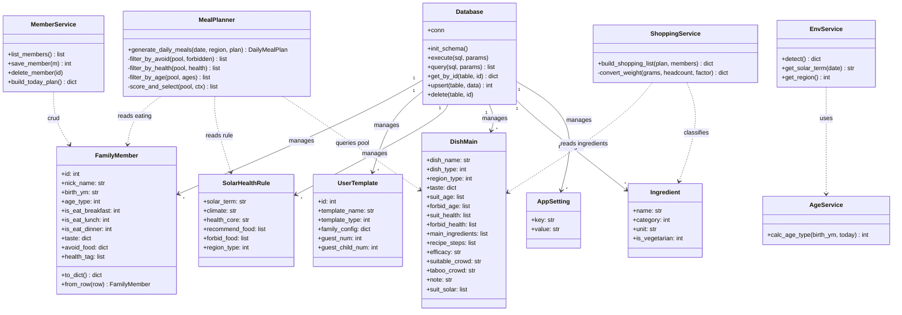
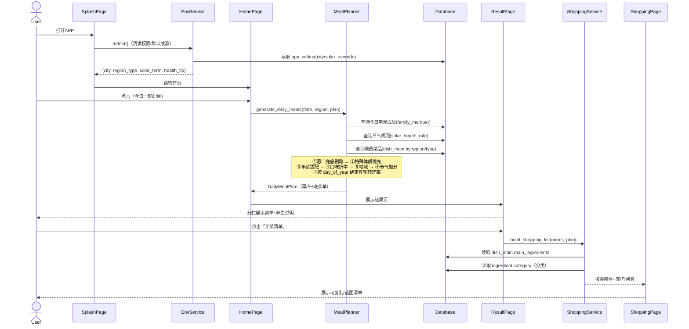
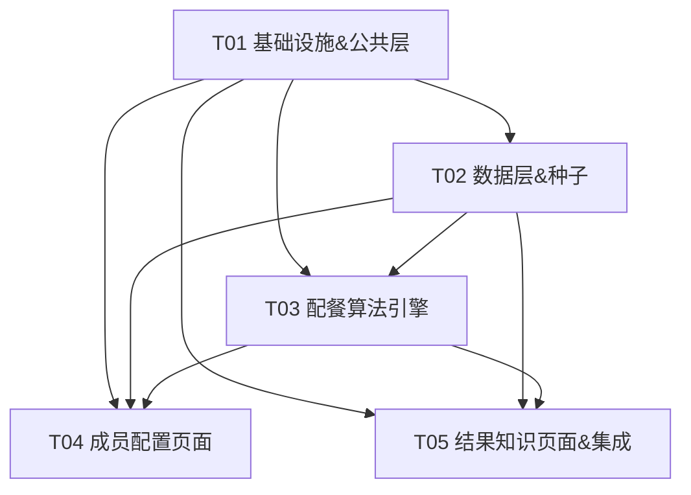

# 家庭四季养生配餐 APP V1.0 — 系统架构设计文档

> 作者：架构师 高见远（Gao）
> 技术栈：**Python 3 + Flet + SQLite**（单机离线、Android APK）
> 文档版本：V1.0

---

## 1. 实现方案与框架选型

### 1.1 方案确认

| 维度 | 选型 | 说明 |
|------|------|------|
| UI 框架 | **Flet**（Python，Material Design） | 用 Python 写界面，无需 Dart；`flet build apk` 可打包安卓；控件天然支持大字号、高对比度 |
| 本地存储 | **SQLite**（`sqlite3` 内置） | 单机离线，无后端；文件即数据库，零运维 |
| 语言 | Python 3.10+ | 语法简洁，适老化逻辑用纯 Python 实现 |
| 打包 | `flet build apk`（需 Flutter SDK 环境） | 见 §8 待明确事项 |

### 1.2 关键设计决策

1. **离线数据驱动**：配餐质量完全取决于「预置数据 + 规则引擎」。因此把成渝家常菜库（约 80 道）、二十四节气养生规则（24 条）、食材库（约 80 条）作为**种子数据**首次启动时写入 SQLite。算法本身是无状态的纯函数，方便测试与迭代。

2. **分层架构（UI / Service / Data）**：
   - `pages/` 只负责布局与事件绑定，不写业务；
   - `services/` 放配餐算法、年龄判定、节气识别、买菜换算；
   - `data/` 放种子数据；`database.py` 放连接与通用 CRUD。
   降低耦合，便于单测。

3. **节气计算零依赖**：采用「寿星公式」（通用节气计算，基于天文近似值）纯 Python 实现，无需联网、无第三方库，按日期精确算出当前节气。

4. **定位处理（务实方案）**：Android 端 Flet 暂无稳定 GPS 插件，且要求「单机离线」。故权限页仅作**引导与提示**，地域默认「成渝」，支持手动切换城市。真实定位可作为后续增强。

5. **非随机算法**：相同成员 + 相同日期 → 结果稳定可复现。每日变化通过「按 `day_of_year` 对候选池做确定性轮转」实现，而非 `random`，符合 PRD「非随机算法」要求。

6. **适老化贯穿**：统一 `theme.py` 提供大字号（正文≥20sp、标题≥28sp）、大按钮（最小高度 56dp）、高对比配色（深字浅底），全 APP 复用。

7. **user_id 兼容**：PRD 表含 `user_id`，V1 为单家庭，默认 `user_id = 1`，保留字段以便未来多家庭扩展，不增加复杂度。

---

## 2. 文件列表（相对路径）

根目录：`C:\Users\cuiht\WorkBuddy\配餐\`

```
配餐/
├── requirements.txt                 # 依赖声明（仅 flet）
├── main.py                          # 应用入口：初始化 DB、加载种子、挂载路由
├── app/
│   ├── __init__.py
│   ├── config.py                    # 全局常量/枚举（年龄段、口味维度、体质标签、菜品类型…）
│   ├── theme.py                     # 适老化主题（字号、配色、控件样式工厂）
│   ├── database.py                  # SQLite 连接、建表、通用 CRUD 辅助
│   ├── models/
│   │   ├── __init__.py
│   │   ├── member.py                # FamilyMember 模型 + 序列化
│   │   ├── template.py              # UserTemplate 模型
│   │   ├── solar.py                 # SolarHealthRule 模型
│   │   ├── dish.py                  # DishMain 模型
│   │   └── ingredient.py            # Ingredient 模型
│   ├── data/
│   │   ├── __init__.py
│   │   ├── seed_solar.py            # 24 节气养生规则（完整数据）
│   │   ├── seed_dishes.py           # 成渝家常菜预置库（约 80 道）
│   │   ├── seed_ingredients.py      # 食材基础库（约 80 条，含分类/单位）
│   │   └── seed_loader.py           # 首次启动写入 SQLite（幂等）
│   ├── services/
│   │   ├── __init__.py
│   │   ├── env_service.py           # 地域识别 + 日期→节气（寿星公式）+ 手动覆盖
│   │   ├── age_service.py           # 出生年月 → 年龄层级判定
│   │   ├── member_service.py        # 成员 CRUD + 今日用餐计划聚合
│   │   ├── meal_planner.py          # ★核心：每日三餐配餐算法
│   │   └── shopping_service.py      # 买菜清单聚合 + 重量换算（克/斤）
│   └── pages/
│       ├── __init__.py
│       ├── splash_page.py           # ① 启动页 & 权限页
│       ├── home_page.py             # ② 首页
│       ├── member_page.py           # ③ 家庭成员管理
│       ├── meal_config_page.py      # ④ 三餐用餐配置
│       ├── template_page.py         # ⑤ 家庭模板管理
│       ├── result_page.py           # ⑥ 今日配餐结果
│       ├── dish_detail_page.py      # ⑦ 菜品详情
│       ├── shopping_page.py         # ⑧ 买菜清单
│       └── solar_page.py            # ⑨ 节气养生知识库
└── docs/
    ├── architecture.md              # 本文档
    ├── class-diagram.mermaid        # 类图（§3.2）
    └── sequence-diagram.mermaid     # 时序图（§4.1）
```

---

## 3. 数据结构和接口设计

### 3.1 数据库表结构（在 PRD 基础上完善）

> 约定：布尔/开关用 `INTEGER` 0/1；JSON 字段统一用 `TEXT` 存储，读写经 `json.dumps/loads`。

#### `family_member`（家庭成员）
| 字段 | 类型 | 说明 |
|------|------|------|
| id | INTEGER PK | 自增 |
| user_id | INTEGER | 默认 1（单家庭） |
| nick_name | TEXT | 昵称 |
| birth_ym | TEXT | 出生年月 `YYYY-MM` |
| age_type | INTEGER | 1婴幼儿/2儿童/3少年/4中青年/5老年（由 age_service 算） |
| is_eat_breakfast | INTEGER | 是否吃早餐 |
| is_eat_lunch | INTEGER | 是否吃午餐 |
| is_eat_dinner | INTEGER | 是否吃晚餐 |
| spicy_level | INTEGER | 辣 1-4 |
| numb_level | INTEGER | 麻 1-4 |
| acid_level | INTEGER | 酸 1-4 |
| salt_level | INTEGER | 咸 1-4 |
| sweet_level | INTEGER | 甜 1-4 |
| avoid_food | TEXT(JSON) | `{"categories":["香辛类","调味类"],"items":["牛肉","虾"],"vegetarian":false}` |
| health_tag | TEXT(JSON) | `["低脂","脾胃虚寒","痛风"]` 等体质/疾病标签数组 |

#### `user_template`（家庭模板）
| 字段 | 类型 | 说明 |
|------|------|------|
| id | INTEGER PK | |
| user_id | INTEGER | 默认 1 |
| template_name | TEXT | 模板名 |
| template_type | INTEGER | 1日常 / 2招待 |
| family_config | TEXT(JSON) | 全部成员档案快照 + 三餐开关（数组） |
| guest_num | INTEGER | 招待额外成年访客数 |
| guest_child_num | INTEGER | 招待额外儿童数 |

#### `solar_health_rule`（节气养生规则）
| 字段 | 类型 | 说明 |
|------|------|------|
| id | INTEGER PK | |
| solar_term | TEXT | 节气名（如 立春） |
| climate | TEXT | 地域气候描述 |
| health_core | TEXT | 养生重点 |
| recommend_food | TEXT(JSON) | 宜食食材名数组 |
| forbid_food | TEXT(JSON) | 忌食食材名数组 |
| region_type | INTEGER | 1成渝 / 2其他 |

#### `dish_main`（菜品主表，PRD 表补充完整字段）
| 字段 | 类型 | 说明 |
|------|------|------|
| id | INTEGER PK | |
| dish_name | TEXT | 菜名 |
| dish_type | INTEGER | 1主食/2素菜/3荤菜/4汤品 |
| region_type | INTEGER | 1成渝 / 2其他（通用） |
| spicy_level | INTEGER | 基础辣度 1-4 |
| numb_level | INTEGER | 基础麻度 1-4 |
| acid_level | INTEGER | 基础酸度 1-4 |
| salt_level | INTEGER | 基础咸度 1-4 |
| sweet_level | INTEGER | 基础甜度 1-4 |
| suit_age | TEXT(JSON) | 适宜年龄层 `[1,2,3,4,5]` |
| forbid_age | TEXT(JSON) | 禁忌年龄层 |
| suit_health | TEXT(JSON) | 适宜体质/疾病标签 |
| forbid_health | TEXT(JSON) | 禁忌体质/疾病标签 |
| main_ingredients | TEXT(JSON) | `[{"name":"猪肉","grams":150,"category":2}, ...]` 每人份主材 |
| recipe_steps | TEXT(JSON) | `["步骤1","步骤2","步骤3"]`（3-5 步） |
| efficacy | TEXT | 中医饮食功效 |
| suitable_crowd | TEXT | 适宜人群说明 |
| taboo_crowd | TEXT | 禁忌人群说明 |
| note | TEXT | 注意事项 |
| suit_solar | TEXT(JSON) | 适宜节气（空=通用） |

#### `ingredient`（新增：食材基础表，支撑买菜清单分类与换算）
| 字段 | 类型 | 说明 |
|------|------|------|
| id | INTEGER PK | |
| name | TEXT | 食材名（与 dish_main.main_ingredients.name 对应） |
| category | INTEGER | 1蔬菜/2肉类/3水产/4杂粮/5其他 |
| unit | TEXT | 默认计量单位（克） |
| alias | TEXT | 别名（可选） |
| is_vegetarian | INTEGER | 是否素食 |

#### `app_setting`（新增：键值配置，存当前地域/节气手动覆盖）
| 字段 | 类型 | 说明 |
|------|------|------|
| key | TEXT PK | 如 `city` / `region_type` / `solar_override` |
| value | TEXT | 值 |

### 3.2 类图（详见 `docs/class-diagram.mermaid`）



### 3.3 核心服务接口签名（伪代码）

```python
# services/env_service.py
def detect() -> dict:
    """返回 {'city','region_type','solar_term','date','health_tip'}；离线默认成渝"""

# services/age_service.py
def calc_age_type(birth_ym: str, today: date) -> int: ...   # 1..5

# services/member_service.py
def build_today_plan() -> dict:
    """
    返回 {'breakfast':[member...], 'lunch':[...], 'dinner':[...],
          'stats': {'breakfast':{headcount,age_dist,health_dist}, ...}}
    """

# services/meal_planner.py
def generate_daily_meals(date: date, region: int, plan: dict) -> dict:
    """
    返回 {
      'term': str, 'health_tip': str,
      'meals': {
         'breakfast': [dish_dict,...],
         'lunch': [...], 'dinner': [...]
      }
    }
    """

# services/shopping_service.py
def build_shopping_list(meals: dict, plan: dict) -> dict:
    """
    返回 {'蔬菜':[{name,grams,jin}], '肉类':[...], '水产':[...], '杂粮':[...]}
    """
```

---

## 4. 程序调用流程

### 4.1 配餐核心时序图（详见 `docs/sequence-diagram.mermaid`）



### 4.2 配餐算法核心步骤（数据驱动，按 PRD 2.4/2.5 优先级）

输入：`date`、`region`、`plan{breakfast/lunch/dinner: [members]}`。

对每一餐 `meal ∈ {breakfast, lunch, dinner}`：

1. **聚合约束**
   - `forbidden` = 并集（所有用餐成员的 `avoid_food.items/categories` + 节气 `forbid_food`）。→ **全员忌口兜底**。
   - `health_needs` = 收集用餐成员 `health_tag`（低脂/低糖/低盐/痛风/老人/幼童等标记）。→ **特殊人群优先**。
   - `age_dist` = 统计各年龄层人数。
   - `taste_target` = 各口味维度取成员均值并四舍五入、clamp(1,4)；无人时取成渝基础（辣2/麻2）。→ **口味折中（温和中间值）**。

2. **候选池筛选（按优先级，硬剔除在前）**
   - **① 忌口剔除**：`dish.main_ingredients.name` 命中 `forbidden` 或 `dish` 含素食冲突 → 剔除。
   - **② 特殊体质/疾病**：剔除 `forbid_health` 与任一成员 `health_tag` 交集非空的菜；标记 `suit_health` 覆盖成员需求的菜为加分。
   - **③ 年龄适配**：剔除 `forbid_age` 含任一在场年龄层的菜；`suit_age` 覆盖在场年龄层加分。
   - **④ 口味**：按 `|dish.taste[d] - taste_target[d]|` 计算口味距离，距离小者加分。
   - **⑤ 地域**：`region_type` 不匹配且非通用（2）的菜降权/剔除。
   - **⑥ 节气**：菜主材命中 `recommend_food` 加分；命中 `forbid_food` 已在①剔除。

3. **选菜（非随机）**
   - 每餐目标结构（见下表），按综合分降序排序候选。
   - 用 `offset = day_of_year % len(pool)` 做确定性轮转，保证「每日不同但可复现」。

4. **三餐差异化结构**

| 餐次 | 主食 | 素菜 | 荤菜 | 汤品 | 特征 |
|------|------|------|------|------|------|
| 早餐 | 1 | 1（多人+1） | 1（软烂易消化） | 1 | 清淡、低油盐、优先老人/幼童 |
| 午餐 | 1 | 2 | 2 | 1 | 营养均衡、能量充足、适配中青年 |
| 晚餐 | 1 | 2 | 1 | 1 | 低脂少油、健脾养胃、杜绝重滋补 |

5. **输出**：`DailyMealPlan`（每道菜附 适配口味等级 / 节气养生说明 / 适配人群）。

6. **买菜清单换算**（`shopping_service`）：按 `main_ingredients.grams × 用餐人数 × 年龄段系数`（老人/幼童≈0.7，其余 1.0）求和，按 `ingredient.category` 分类，输出克 + 斤（1斤=500克）。

---

## 5. 任务列表（按实现顺序，含依赖）

> 遵循「不超过 5 个任务、首任务为基础设施、单任务≥3 文件」的分解原则，按功能模块聚合。

| 任务 | 名称 | 源文件 | 依赖 | 优先级 |
|------|------|--------|------|--------|
| **T01** | 项目基础设施 & 公共层 | `requirements.txt`, `main.py`, `app/config.py`, `app/theme.py`, `app/database.py` | — | P0 |
| **T02** | 数据层 & 预置种子数据 | `app/models/*.py`(5), `app/data/seed_solar.py`, `app/data/seed_dishes.py`, `app/data/seed_ingredients.py`, `app/data/seed_loader.py` | T01 | P0 |
| **T03** | 核心配餐算法引擎 | `services/env_service.py`, `services/age_service.py`, `services/member_service.py`, `services/meal_planner.py`, `services/shopping_service.py` | T01, T02 | P0 |
| **T04** | 成员与配置类页面 | `pages/splash_page.py`, `pages/home_page.py`, `pages/member_page.py`, `pages/meal_config_page.py`, `pages/template_page.py` | T01, T02, T03 | P1 |
| **T05** | 结果与知识类页面 & 集成 | `pages/result_page.py`, `pages/dish_detail_page.py`, `pages/shopping_page.py`, `pages/solar_page.py` | T01, T02, T03 | P1 |

**说明**：T04/T05 依赖 T03 的算法服务（页面调用 `generate_daily_meals` / `build_shopping_list`）；T02 提供数据，T01 提供运行底座。任务间为清晰的分层依赖，无环。

### 任务依赖图



---

## 6. 依赖包列表

```
# requirements.txt
flet>=0.21.0        # Python UI 框架，Material Design，可打包 APK
```

> 说明：SQLite 由 Python 标准库 `sqlite3` 提供，无需安装；节气计算、年龄判定、配餐算法均为纯 Python 实现，无额外依赖。保持最小依赖，利于离线打包与稳定性。

---

## 7. 共享知识（跨文件约定）

- **常量集中**：所有枚举/标签定义在 `app/config.py`，例如：
  - `AGE_TYPES = {1:'婴幼儿',2:'儿童',3:'少年',4:'中青年',5:'老年'}`
  - `TASTE_DIMS = ['spicy','numb','acid','salt','sweet']`（等级 1-4：1无/2微/3中/4重）
  - `HEALTH_TAGS = ['低脂','低糖','低盐','脾胃虚寒','内热上火','体虚温补','痛风','过敏体质','产后滋补','婴幼儿软烂','儿童易消化','老人养胃']`
  - `DISH_TYPES = {1:'主食',2:'素菜',3:'荤菜',4:'汤品'}`
  - `REGION_TYPES = {1:'成渝',2:'其他'}`
  - `INGREDIENT_CATS = {1:'蔬菜',2:'肉类',3:'水产',4:'杂粮',5:'其他'}`
  - 成渝基础口味：`BASE_TASTE = {'spicy':2,'numb':2,'acid':1,'salt':2,'sweet':1}`
- **JSON 字段**：`avoid_food`/`health_tag`/`recommend_food`/`forbid_food`/`main_ingredients`/`recipe_steps`/`suit_age` 等统一 JSON 字符串存取，提供 `json_encode/decode` 辅助。
- **数据库路径**：`app/database.py` 中固定 `DB_PATH = os.path.join(user_data_dir, 'meal.db')`，首次启动 `init_schema()` + `seed_loader.run()`（幂等：已存在则跳过）。
- **适老化主题**：`theme.py` 暴露 `LARGE_TEXT`、`TITLE_TEXT`、`BUTTON_HEIGHT=56`、`HIGH_CONTRAST` 配色；所有页面统一引用，禁止页面内硬编码字号。
- **重量换算**：`1 斤 = 500 克`；年龄段系数 `AGE_PORTION = {1:0.7, 2:0.8, 3:1.0, 4:1.0, 5:0.7}`（幼童/老人减量）。
- **非随机约定**：轮转偏移 `offset = date.timetuple().tm_yday % pool_size`，保证同日同输入结果一致。
- **统一返回结构**：服务层返回 `dict`（非异常路径）；空数据返回空结构而非 `None`，降低页面判空成本。

---

## 8. 待明确事项

1. **APK 打包环境**：`flet build apk` 需要本机安装 Flutter SDK 与 Android SDK。V1 开发阶段用 `flet run` 验证；正式打包建议在 CI/专用环境执行，需团队确认由谁提供打包环境。
2. **真实 GPS 定位**：Flet Android 当前无官方稳定定位插件。本报告采用「默认成渝 + 手动切换城市」方案，权限页为引导式。若产品坚持自动定位，需引入第三方定位插件或自研 Flet 原生通道（增加复杂度），请确认是否必要。
3. **菜品数据规模**：本报告建议预置约 80 道成渝家常菜（主食~15/素菜~25/荤菜~25/汤品~15）覆盖四季与主要体质。具体菜谱内容需养生/营养顾问审核，目前由架构侧按成渝家常体系草拟，待业务确认。
4. **招待模板的临时访客口味**：`user_template.guest_num/guest_child_num` 仅计人数，访客无独立口味/忌口档案。算法中对访客采用「温和中间值 + 老少兼容」默认策略，是否需支持为访客单独录入档案待定。
5. **买菜清单重量精度**：目前按「每人份克重 × 人数 × 年龄系数」线性估算，未考虑菜品间共享食材去重（如两道菜都用葱）。V1 可接受粗略合计；若需精确合并同名食材，可在 T05 集成阶段增强 `shopping_service`，请确认精度要求。
6. **多家庭/多用户**：`user_id` 字段已保留但 V1 仅单家庭（=1）。导出/备份、跨设备迁移等功能不在 V1 范围，待后续版本。

---

*文档结束 — 架构师 高见远（Gao）*
