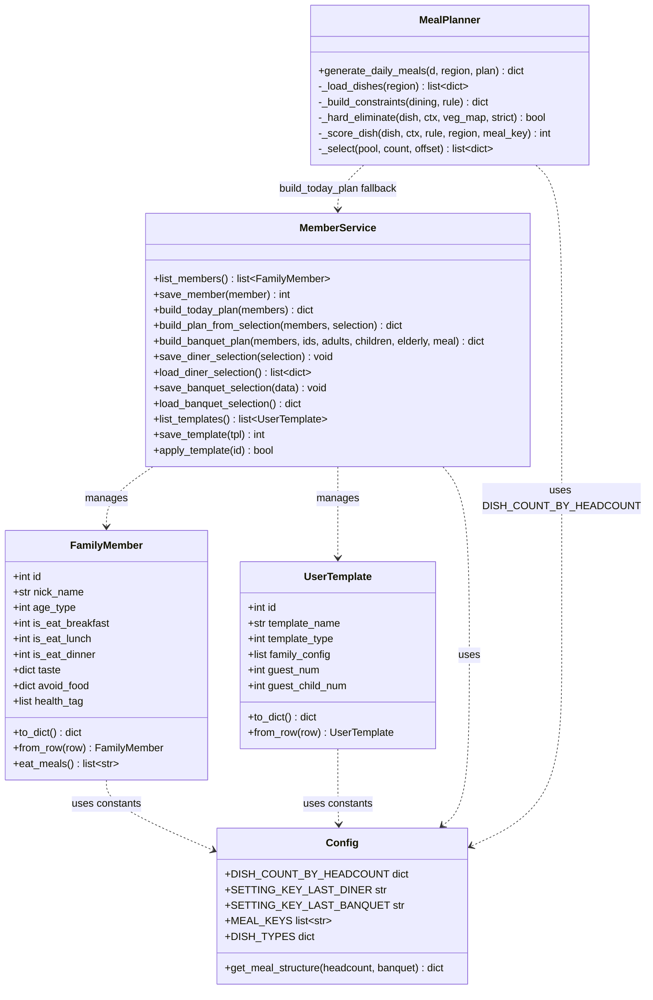
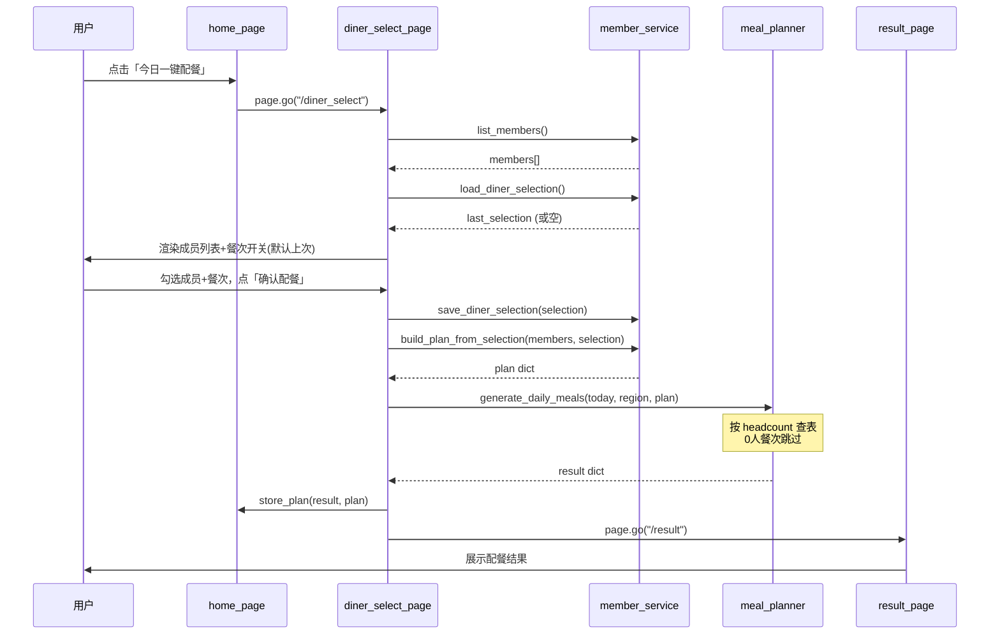
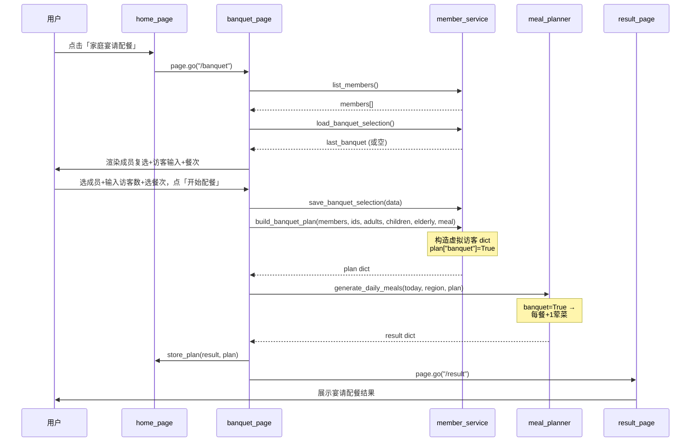
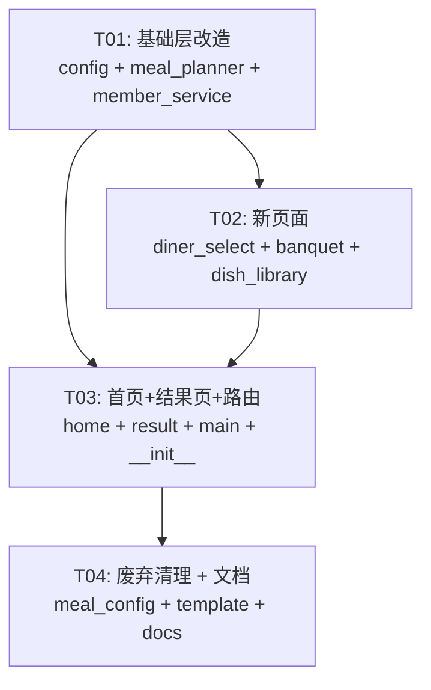

# 增量架构设计 v11 — 配餐流程改造

> 架构师：高见远（Gao）  
> 基于：增量PRD（C1/C2/C3 变更）  
> 技术栈：Python + Flet + SQLite（无变更）

---

## 1. 实现方案

### 1.1 核心技术挑战

| 挑战 | 方案 |
|------|------|
| 菜品数量从硬编码改为按人数动态查表 | 在 `config.py` 新增人数段→菜品结构映射表 + 查表函数，`meal_planner.py` 替换 `MEAL_STRUCTURE` 引用 |
| 一键配餐从「直接生成」改为「先选人」 | 新增 `diner_select_page.py`，选人结果不写DB而是传入内存 plan dict |
| 宴请场景：访客无成员档案但需参与配餐 | 构造虚拟访客 dict 加入 plan，只贡献人数和展示标签，不做菜品过滤 |
| 记住上次选择 | 复用现有 `app_setting` 表，JSON 序列化选人结果 |
| 模板功能从首页降级到选人页 | 选人页底部加「应用模板/保存模板」按钮，复用现有 `member_service` 模板CRUD |

### 1.2 架构模式

维持现有 **函数式页面 + 服务层 + 数据模型** 三层结构，不引入新框架。

---

## 2. 文件修改清单

| 文件 | 操作 | 改动内容 |
|------|------|----------|
| `app/config.py` | **修改** | 新增 `DISH_COUNT_BY_HEADCOUNT` 人数段查表、`SETTING_KEY_LAST_DINER` / `SETTING_KEY_LAST_BANQUET` 常量；旧 `MEAL_STRUCTURE` / `BREAKFAST_EXTRA_VEGGIE_HEADCOUNT` 标记废弃 |
| `app/services/meal_planner.py` | **修改** | `generate_daily_meals` 内部菜品数量改为按每餐 headcount 动态查表；0人餐次跳过；支持 `plan["banquet"]` 标志 +1荤菜 |
| `app/services/member_service.py` | **修改** | 新增 `build_plan_from_selection()` / `build_banquet_plan()` / `save_diner_selection()` / `load_diner_selection()` / `save_banquet_selection()` / `load_banquet_selection()` |
| `app/pages/diner_select_page.py` | **新增** | 就餐人员选择页：成员列表 + 每人早/午/晚开关 + 模板按钮 + 确认配餐 |
| `app/pages/banquet_page.py` | **新增** | 宴请配餐页：选家庭成员 + 访客成人数/儿童数/老人数 + 餐次选择 |
| `app/pages/dish_library_page.py` | **新增** | 养生菜谱库：菜品列表浏览，按类型筛选，点击进详情 |
| `app/pages/home_page.py` | **修改** | 4按钮：今日一键配餐→/diner_select、家庭宴请配餐→/banquet、家庭成员管理→/member、养生菜谱库→/dish_library；移除三餐配置/模板/节气/买菜按钮 |
| `app/pages/result_page.py` | **修改** | 「重新配餐」改为跳转 /diner_select 而非直接重新生成 |
| `app/pages/__init__.py` | **修改** | 新增 diner_select_page / banquet_page / dish_library_page 导入；移除 meal_config_page / template_page 导入 |
| `main.py` | **修改** | 路由表新增 /diner_select / /banquet / /dish_library；移除 /meal_config / /template |
| `app/pages/meal_config_page.py` | **废弃** | 不再注册路由，文件保留但标记 deprecated |
| `app/pages/template_page.py` | **废弃** | 模板功能降级到 diner_select_page 内联实现，独立页面不再注册路由 |

---

## 3. 数据结构与接口

### 3.1 类图



### 3.2 新增数据结构

**选人结果（内存 + app_setting 持久化）**：

```python
# diner_selection — 存入 app_setting[SETTING_KEY_LAST_DINER]
[
    {"id": 1, "breakfast": True, "lunch": True, "dinner": False},
    {"id": 2, "breakfast": True, "lunch": True, "dinner": True},
]

# banquet_selection — 存入 app_setting[SETTING_KEY_LAST_BANQUET]
{
    "member_ids": [1, 3],
    "guest_adults": 2,
    "guest_children": 1,
    "guest_elderly": 0,
    "meal_key": "lunch",  # "lunch" 或 "dinner"
}
```

**宴请虚拟访客 dict（注入 plan）**：

```python
{
    "id": -1,              # 负数ID标识虚拟访客
    "nick_name": "访客",
    "age_type": 4,         # 成人/2儿童/5老年
    "taste": config.BASE_TASTE,  # 默认口味，不参与折中
    "avoid_food": {"categories": [], "items": [], "vegetarian": False},
    "health_tag": ["老人养胃"],  # 老人访客加此标签；儿童加"儿童易消化"
}
```

---

## 4. 核心算法改造方案

### 4.1 人数段菜品数量表（config.py 新增）

```python
DISH_COUNT_BY_HEADCOUNT = {
    (1, 2): {   # 1-2人
        "breakfast": {1: 1, 2: 1, 3: 0, 4: 0},   # 主食/素/荤/汤
        "lunch":     {1: 1, 2: 1, 3: 1, 4: 0},
        "dinner":    {1: 1, 2: 0, 3: 1, 4: 0},
    },
    (3, 4): {   # 3-4人
        "breakfast": {1: 1, 2: 1, 3: 1, 4: 0},
        "lunch":     {1: 1, 2: 1, 3: 1, 4: 1},
        "dinner":    {1: 1, 2: 1, 3: 1, 4: 0},
    },
    (5, 6): {   # 5-6人
        "breakfast": {1: 1, 2: 1, 3: 1, 4: 0},
        "lunch":     {1: 1, 2: 2, 3: 1, 4: 1},
        "dinner":    {1: 1, 2: 1, 3: 1, 4: 1},
    },
    (7, 999): { # 7人及以上
        "breakfast": {1: 1, 2: 1, 3: 1, 4: 1},
        "lunch":     {1: 1, 2: 2, 3: 2, 4: 1},
        "dinner":    {1: 1, 2: 2, 3: 1, 4: 1},
    },
}

def get_meal_structure(headcount: int, banquet: bool = False) -> dict:
    """根据用餐人数查表返回三餐菜品结构。

    Args:
        headcount: 该餐用餐总人数。
        banquet: 是否宴请场景（每餐+1荤菜）。

    Returns:
        {"breakfast": {1:n, 2:n, 3:n, 4:n}, "lunch": {...}, "dinner": {...}}
    """
    for (lo, hi), structure in DISH_COUNT_BY_HEADCOUNT.items():
        if lo <= headcount <= hi:
            result = {k: dict(v) for k, v in structure.items()}
            if banquet:
                for meal in result:
                    result[meal][3] = result[meal].get(3, 0) + 1
            return result
    # 兜底：0人返回全零
    return {m: {1: 0, 2: 0, 3: 0, 4: 0} for m in MEAL_KEYS}
```

### 4.2 meal_planner.py 改造

**改动点**：`generate_daily_meals` 循环内，替换硬编码 `MEAL_STRUCTURE` 查找逻辑。

```python
# --- 改造前 ---
structure = dict(config.MEAL_STRUCTURE[meal_key])
if meal_key == "breakfast":
    headcount = plan.get("stats", {}).get(meal_key, {}).get("headcount", 0)
    if headcount >= config.BREAKFAST_EXTRA_VEGGIE_HEADCOUNT:
        structure[2] = structure.get(2, 1) + 1

# --- 改造后 ---
headcount = plan.get("stats", {}).get(meal_key, {}).get("headcount", 0)
if headcount == 0:
    continue  # 0人跳过该餐
banquet = plan.get("banquet", False)
structure = config.get_meal_structure(headcount, banquet=banquet)[meal_key]
```

其余逻辑（候选池筛选、打分、轮转选菜）不变。

### 4.3 member_service.py 新增函数

```python
def build_plan_from_selection(
    members: list[FamilyMember],
    selection: list[dict],
) -> dict:
    """根据显式选人结果构建用餐计划（不写DB）。

    Args:
        members: 全部家庭成员。
        selection: [{"id":1, "breakfast":True, "lunch":True, "dinner":False}]
    Returns:
        与 build_today_plan 相同结构的 plan dict。
    """
    plan = {meal: [] for meal in config.MEAL_KEYS}
    sel_map = {s["id"]: s for s in selection}
    for m in members:
        s = sel_map.get(m.id)
        if not s:
            continue
        m_dict = m.to_dict()
        for meal in config.MEAL_KEYS:
            if s.get(meal):
                plan[meal].append(m_dict)
    _build_stats(plan)
    return plan


def build_banquet_plan(
    members: list[FamilyMember],
    member_ids: list[int],
    guest_adults: int,
    guest_children: int,
    guest_elderly: int,
    meal_key: str,
) -> dict:
    """构建宴请用餐计划。

    老人计入成人总数（age_type=5），儿童标注 age_type=2。
    访客不参与忌口过滤，仅贡献人数和展示标签。
    """
    plan = {meal: [] for meal in config.MEAL_KEYS}
    # 家庭成员
    for m in members:
        if m.id in member_ids:
            plan[meal_key].append(m.to_dict())
    # 虚拟访客
    idx = 0
    for _ in range(guest_adults):
        plan[meal_key].append(_make_guest_dish(idx, age_type=4, tags=[]))
        idx += 1
    for _ in range(guest_children):
        plan[meal_key].append(_make_guest_dish(idx, age_type=2, tags=["儿童易消化"]))
        idx += 1
    for _ in range(guest_elderly):
        plan[meal_key].append(_make_guest_dish(idx, age_type=5, tags=["老人养胃"]))
        idx += 1
    plan["banquet"] = True
    plan["banquet_meal"] = meal_key
    _build_stats(plan)
    return plan


def _make_guest_dish(idx: int, age_type: int, tags: list) -> dict:
    """构造虚拟访客 dict。"""
    return {
        "id": -(idx + 1),
        "nick_name": "访客",
        "age_type": age_type,
        "taste": dict(config.BASE_TASTE),
        "avoid_food": {"categories": [], "items": [], "vegetarian": False},
        "health_tag": tags,
    }


def _build_stats(plan: dict) -> None:
    """填充 plan["stats"]（提取自 build_today_plan 的公共逻辑）。"""
    stats = {}
    for meal in config.MEAL_KEYS:
        diners = plan[meal]
        age_dist, health_dist = {}, {}
        for m_dict in diners:
            at = m_dict["age_type"]
            age_dist[at] = age_dist.get(at, 0) + 1
            for h in m_dict.get("health_tag", []):
                health_dist[h] = health_dist.get(h, 0) + 1
        stats[meal] = {"headcount": len(diners), "age_dist": age_dist, "health_dist": health_dist}
    plan["stats"] = stats


# --- 选人记忆持久化 ---
def save_diner_selection(selection: list[dict]) -> None:
    DB.set_setting(config.SETTING_KEY_LAST_DINER, config.json_encode(selection))

def load_diner_selection() -> list[dict]:
    raw = DB.get_setting(config.SETTING_KEY_LAST_DINER)
    data = config.json_decode(raw)
    return data if isinstance(data, list) else []

def save_banquet_selection(data: dict) -> None:
    DB.set_setting(config.SETTING_KEY_LAST_BANQUET, config.json_encode(data))

def load_banquet_selection() -> dict:
    raw = DB.get_setting(config.SETTING_KEY_LAST_BANQUET)
    data = config.json_decode(raw)
    return data if isinstance(data, dict) else {}
```

---

## 5. 新页面设计

### 5.1 就餐人员选择页 (`diner_select_page.py`)

**路由**：`/diner_select`

**UI 结构**：
```
┌─ AppBar: 今日就餐人员 ────────────────┐
│                                        │
│  [提示文字] 勾选今日就餐人员及餐次      │
│                                        │
│  ┌─ Card: 张三（中青年）─────────────┐ │
│  │  ☑ 早餐  ☑ 午餐  ☐ 晚餐          │ │
│  └────────────────────────────────────┘ │
│  ┌─ Card: 李四（老年）───────────────┐ │
│  │  ☑ 早餐  ☑ 午餐  ☑ 晚餐          │ │
│  └────────────────────────────────────┘ │
│  ...                                    │
│                                        │
│  ┌─ 模板区域 ────────────────────────┐ │
│  │  [Dropdown: 选择模板]  [应用]      │ │
│  │  [TextField: 模板名]    [保存模板]  │ │
│  └────────────────────────────────────┘ │
│                                        │
│  [确认配餐] （大按钮，全宽）            │
│                                        │
└────────────────────────────────────────┘
```

**数据流**：
1. `list_members()` 获取全部成员
2. `load_diner_selection()` 获取上次选择，无则默认全选三餐
3. 用户勾选后点「确认配餐」→ `save_diner_selection()` 持久化
4. `build_plan_from_selection(members, selection)` 构建 plan
5. `generate_daily_meals(date.today(), region, plan)` 生成结果
6. `store_plan(result, plan)` + `page.go("/result")`

**模板功能（内联）**：
- Dropdown 列出已有模板，点「应用」→ `apply_template(id)` 后刷新成员列表
- TextField 输入名称，点「保存模板」→ `save_template()` 保存当前选人快照

### 5.2 宴请配餐页 (`banquet_page.py`)

**路由**：`/banquet`

**UI 结构**：
```
┌─ AppBar: 家庭宴请配餐 ────────────────┐
│                                        │
│  [提示] 选择参加宴请的家庭成员          │
│                                        │
│  ☑ 张三  ☑ 李四  ☐ 王五               │
│                                        │
│  ── 访客人数 ──                        │
│  成人访客: [  2  ]                     │
│  儿童数:   [  1  ]                     │
│  老人数:   [  0  ]                     │
│                                        │
│  ── 餐次选择 ──                        │
│  ○ 午餐  ● 晚餐                        │
│                                        │
│  [开始配餐] （大按钮，全宽）            │
│                                        │
└────────────────────────────────────────┘
```

**数据流**：
1. `list_members()` + `load_banquet_selection()` 恢复上次
2. 用户选择成员 + 输入访客数 + 选餐次
3. 点「开始配餐」→ `save_banquet_selection()` 持久化
4. `build_banquet_plan(members, ids, adults, children, elderly, meal)` 构建 plan
5. `generate_daily_meals(date.today(), region, plan)` 生成（plan 含 `banquet=True`）
6. `store_plan(result, plan)` + `page.go("/result")`

### 5.3 养生菜谱库页 (`dish_library_page.py`)

**路由**：`/dish_library`

**UI 结构**：
```
┌─ AppBar: 养生菜谱库 ───────────────────┐
│                                        │
│  [全部] [主食] [素菜] [荤菜] [汤品]    │  ← 类型筛选
│                                        │
│  ┌─ Card: 回锅肉 ────────────────────┐ │
│  │  【荤菜】  口味：中辣/微麻/...      │ │
│  └────────────────────────────────────┘ │
│  ┌─ Card: 番茄炒蛋 ──────────────────┐ │
│  │  【素菜】  口味：...               │ │
│  └────────────────────────────────────┘ │
│  ...                                    │
│                                        │
└────────────────────────────────────────┘
```

**数据流**：
1. `DB.query("SELECT * FROM dish_main ORDER BY id")` 加载全部菜品
2. 类型筛选按钮过滤 `dish_type`
3. 点击菜品卡片 → `page.go(f"/dish/{id}")`

---

## 6. 程序调用流程

### 6.1 一键配餐流程（改造后）



### 6.2 宴请配餐流程



---

## 7. 共享知识

### 7.1 新增常量（config.py）

```python
# app_setting 键名
SETTING_KEY_LAST_DINER = "last_diner_selection"
SETTING_KEY_LAST_BANQUET = "last_banquet_selection"

# 人数段→菜品数量表
DISH_COUNT_BY_HEADCOUNT = { ... }  # 见 §4.1

# 查表函数
def get_meal_structure(headcount: int, banquet: bool = False) -> dict: ...
```

### 7.2 约定

| 约定 | 说明 |
|------|------|
| plan dict 新增字段 | `plan["banquet"]` (bool)、`plan["banquet_meal"]` (str) |
| 虚拟访客 ID | 负数（-1, -2, ...），与真实成员区分 |
| 0人餐次处理 | `generate_daily_meals` 内 `continue` 跳过，结果中该餐为空列表 |
| 宴请只配1餐 | plan 中仅 `banquet_meal` 对应的 key 有值，其余为空列表 |
| 旧常量废弃 | `MEAL_STRUCTURE`、`BREAKFAST_EXTRA_VEGGIE_HEADCOUNT` 保留但不再使用，避免破坏旧引用 |
| 选人记忆 | app_setting 存 JSON，页面加载时读取，确认时写入 |
| 模板 | 模板功能移入选人页内联，独立 template_page 不再注册路由 |

---

## 8. 任务列表

### T01: 基础层改造 — 常量 + 服务 + 算法

| 项 | 内容 |
|----|------|
| **源文件** | `app/config.py`, `app/services/meal_planner.py`, `app/services/member_service.py` |
| **依赖** | 无 |
| **优先级** | P0 |

**工作内容**：
1. `config.py`：新增 `DISH_COUNT_BY_HEADCOUNT` 表、`get_meal_structure()` 函数、`SETTING_KEY_LAST_DINER` / `SETTING_KEY_LAST_BANQUET` 常量
2. `meal_planner.py`：`generate_daily_meals` 内替换菜品数量逻辑为动态查表，0人跳过，支持 banquet +1荤菜
3. `member_service.py`：新增 `build_plan_from_selection()`、`build_banquet_plan()`、`_make_guest_dish()`、`_build_stats()`、选人记忆读写4个函数

### T02: 新页面 — 就餐选人 + 宴请配餐 + 菜谱库

| 项 | 内容 |
|----|------|
| **源文件** | `app/pages/diner_select_page.py`(新), `app/pages/banquet_page.py`(新), `app/pages/dish_library_page.py`(新) |
| **依赖** | T01 |
| **优先级** | P0 |

**工作内容**：
1. `diner_select_page.py`：成员列表 + 每人早/午/晚 Checkbox + 上次选择恢复 + 模板 Dropdown/保存 + 确认配餐按钮
2. `banquet_page.py`：成员 Checkbox + 访客成人/儿童/老人 TextField + 餐次 Radio + 上次选择恢复 + 开始配餐按钮
3. `dish_library_page.py`：菜品列表 + 类型筛选按钮 + 点击跳转 /dish/{id}

### T03: 首页 + 结果页 + 路由集成

| 项 | 内容 |
|----|------|
| **源文件** | `app/pages/home_page.py`, `app/pages/result_page.py`, `main.py`, `app/pages/__init__.py` |
| **依赖** | T01, T02 |
| **优先级** | P0 |

**工作内容**：
1. `home_page.py`：改为4按钮（今日一键配餐→/diner_select、家庭宴请配餐→/banquet、家庭成员管理→/member、养生菜谱库→/dish_library），移除旧按钮
2. `result_page.py`：「重新配餐」按钮改为 `page.go("/diner_select")`
3. `main.py`：路由表新增 /diner_select / /banquet / /dish_library，移除 /meal_config / /template
4. `__init__.py`：新增3个页面导入，移除 meal_config_page / template_page 导入

### T04: 废弃页面清理 + 文档

| 项 | 内容 |
|----|------|
| **源文件** | `app/pages/meal_config_page.py`, `app/pages/template_page.py`, `docs/architecture_v11_increment.md` |
| **依赖** | T03 |
| **优先级** | P1 |

**工作内容**：
1. `meal_config_page.py`：文件头部标注 `@deprecated`，不再被路由引用
2. `template_page.py`：文件头部标注 `@deprecated`，模板逻辑已由 diner_select_page 内联实现
3. 确认无其他文件引用已废弃页面

---

## 9. 任务依赖图



---

## 10. 不确定项与假设

| 项 | 说明 |
|----|------|
| 节气养生知识 / 买菜清单入口 | PRD 指定首页仅4按钮。假设买菜清单仍从结果页进入（已有），节气养生知识入口从首页移除但路由保留，后续可从其他入口恢复 |
| 旧 meal_config 页面是否删除文件 | 保留文件仅标记 deprecated，不物理删除，降低回滚风险 |
| 宴请场景的访客口味折中 | 访客使用 BASE_TASTE 默认口味参与口味折中计算，PRD未明确排除 |
| 儿童是否计入菜品数量查表人数 | 是，所有用餐人数（含儿童、老人、访客）均计入 headcount |
| 模板保存选人快照 | 保存当前 selection（含 member_id + 餐次勾选）到 `family_config`，应用时恢复勾选状态而非覆盖成员档案 |
